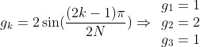
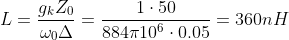
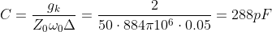
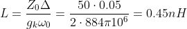
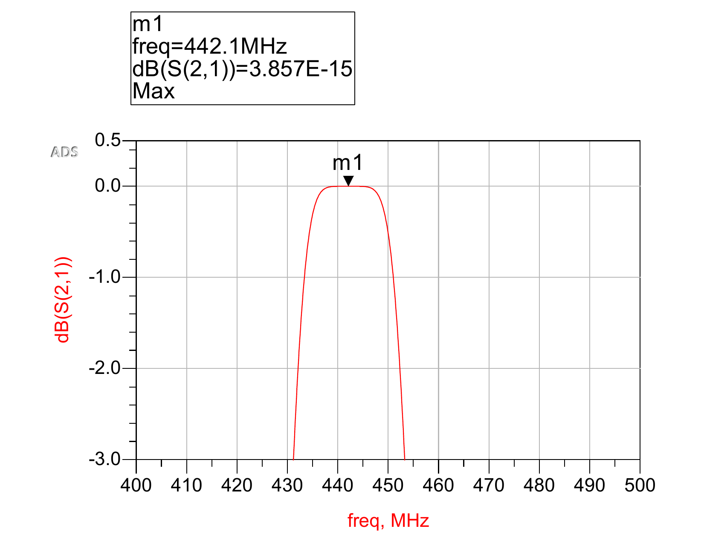
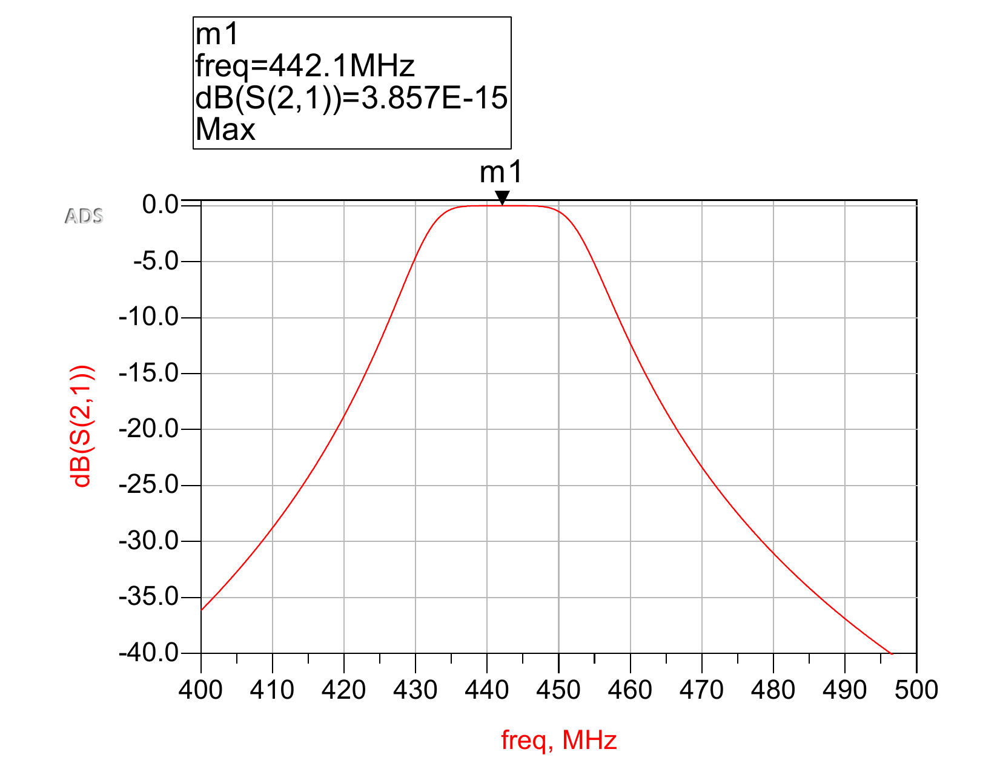
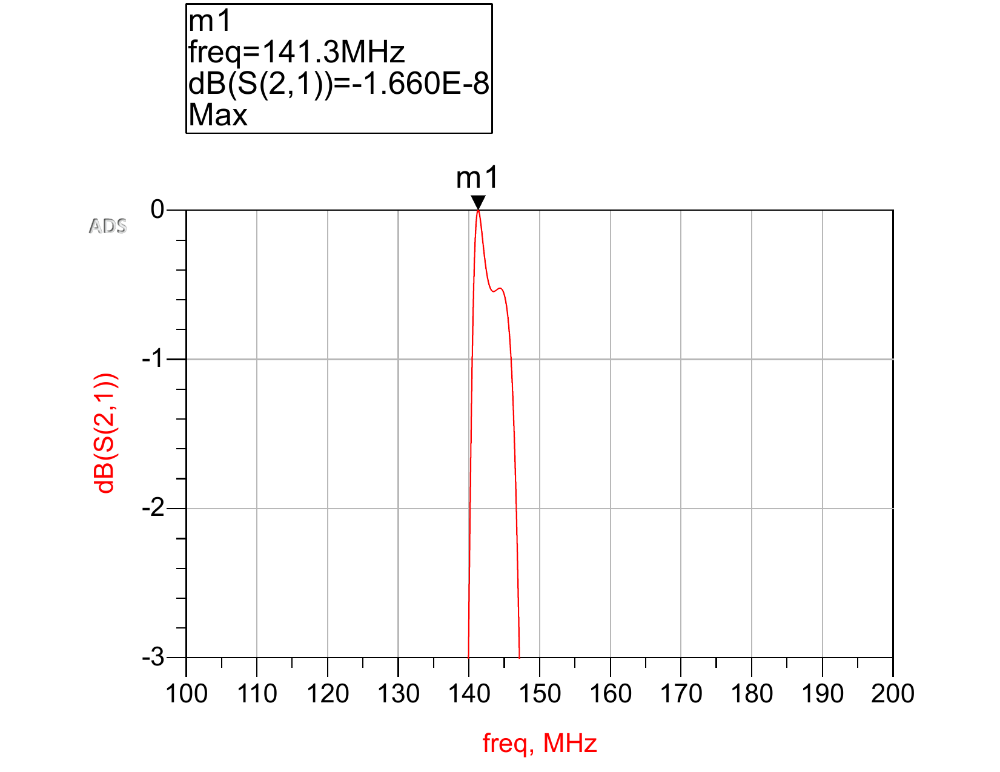
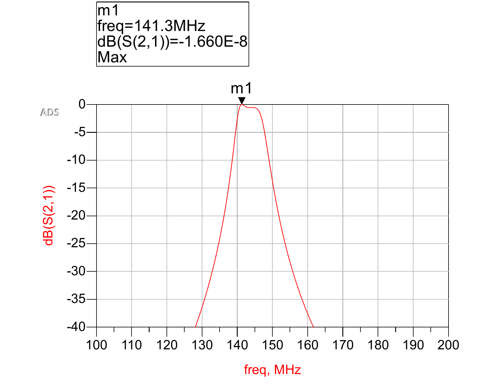

# UHF+VHF Filter Design for CubeSat Communication System

The following are the steps taken to design and simulate the analogue filters for a CubeSat communication system. The design is in accordance with the standards approved by the government of Canada and Canadian Satellite Design Competition (CSDC) guidlines. The purpose of this filter is to remove unwanted components from down-link and up-link signals.

The simulation of this design was solely done on eysight Advanced Design System software. The objective is to design two band-pass filters with center frequencies at 144 and 442 MHz. The filter with center frequency in the VHF region is implemented for up-link signals, and the one in the UHF region is implemented for down-link signals. Since the communication protocol in use is 2FSK, the minimum bandwidth for the VHF filter is 4.8 KHz, and for the UHF filter is 38.4 KHz. The following is the formula to obtain a minimum bandwidth for 2FSK signals:

BW = 2Rb + 2&Delta;f

Where Rb is bit rate and &Delta;f is frequency shift. For us to have no overlap between the transmitted binary signals, the frequency shift must be greater than or equal to the bit rate. Up-link communications are to occur at a rate of 1200 bps and down-link communications occur at a rate of 9600 bps. Hence, during design we must make sure the bandwidth of the S21 response is not less than the bandwidth determined by the above equation.

In the following design a 3rd order circuit is used to achieve the required performance using only passive components:

This is a 3rd order Butterworth filter. This design was simply put together by superposing a low-pass filter onto a high-pass filter. The following figure better represents the design rational:

The component values are calculated using 3rd order circuit formulas which can be derived from scratch. However, for the sake of saving time I will skip the derivation part. To calculate the component values first we define the problem as follows:

Design a band-pass filter having a maximally flat response, with N=3. The centre frequency is 442 MHz, the bandwidth is 5% of the centre frequency, and the impedance is 50 Ohms to match the load.

*fc* = 442 MHz  
*&omega;0* = 884&pi;106  
*&Delta; = 0.05*  
*N* = 3  
*Z0* = 50&ohm;

The factor *gk* is called the element value of the circuit and the formula for it is as follows:

Note that for series components we use the following formulas to calculate L and C (Repeat the same process accounting for different element values and/or centre frequencies):

And for parallel components we use the following formulas:

The S21 responses for the UHF radio band based on the calculated values are as follows:

UHF S21 response (-3 dB limited y-axis)

UHF S21 response (-40 dB limited y-axis)

And the VHF radio band on calculated values is as follows:

VHF S21 response (-3 dB limited y-axis)

VHF S21 response (-40 dB limited y-axis)

I hope this article has shed some light on how to design band-pass filters using only passive components.